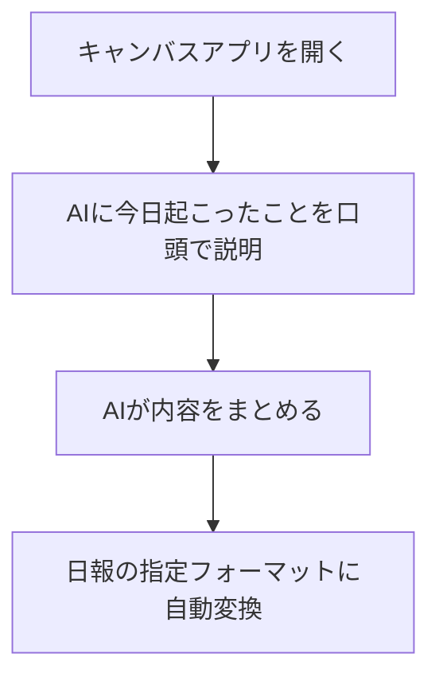
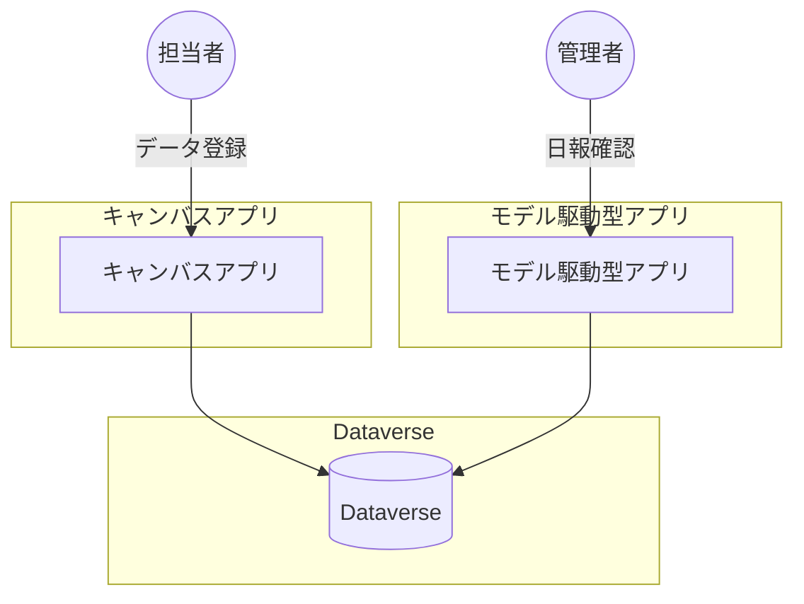

# DailyWorkReport
AIを利用して日報作成を実行することができます。

## ソリューションの特長
スマホあるいはWindowsの文字起こしの機能を利用して報告を音声入力します。フォーマットへは生成AIが自動的に変換してくれます。

https://github.com/user-attachments/assets/f3a590d4-3598-4632-a8f6-ae8b7a7da09c

### モバイル対応
モバイルアプリにも最適化されて表示します。

### プロセスのイメージ
以下のようなプロセスに利用することを想定しています。

> [!Note]
> ソリューションへの感想や要望はぜひ[ギークフジワラのXアカウント](https://x.com/geekfujiwara/status/1899917141153108344)に共有ください!

## アーキテクチャ
このソリューションは日報を管理するアプリです。AIで文字起こしした口頭の説明を日報のフォーマットに変更してくれます。以下のオブジェクトが含まれています。モデル駆動型アプリとキャンバスアプリは同じデータバースに接続しています。キャンバスアプリを使ってデータを登録しモデル駆動型アプリで登録された日報を確認することが出来ます。

## 前提条件
AI Builder 、Dataverse 、モデル駆動型アプリを利用しています。そのため、Power Apps Premium ライセンスが必要です。

## ソリューションのインポート方法
[ソリューションはこちら](https://github.com/geekfujiwara/DailyWorkReport/releases/tag/DailyWorkReport)から入手できます。入手したソリューションはインポートすればすぐに利用可能です。
