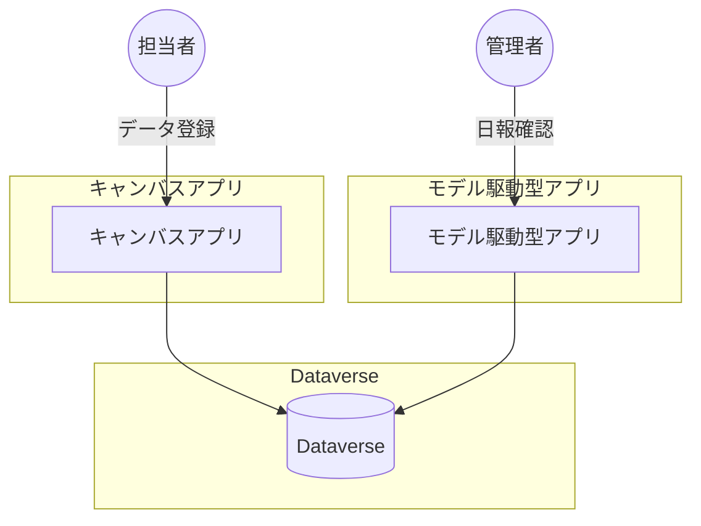

# DailyWorkReport
AIを利用して日報作成を実行

```mermaid
 graph TD;
    subgraph Dataverse;
        DB[(Dataverse)];
    end

    subgraph キャンバスアプリ;
        CA[キャンバスアプリ];
    end

    subgraph モデル駆動型アプリ;
        MA[モデル駆動型アプリ];
    end

    CA --> DB;
    MA --> DB;

    担当者((担当者)) -->|データ登録| CA;
    管理者((管理者)) -->|日報確認| MA;
```
